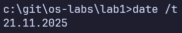
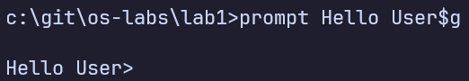
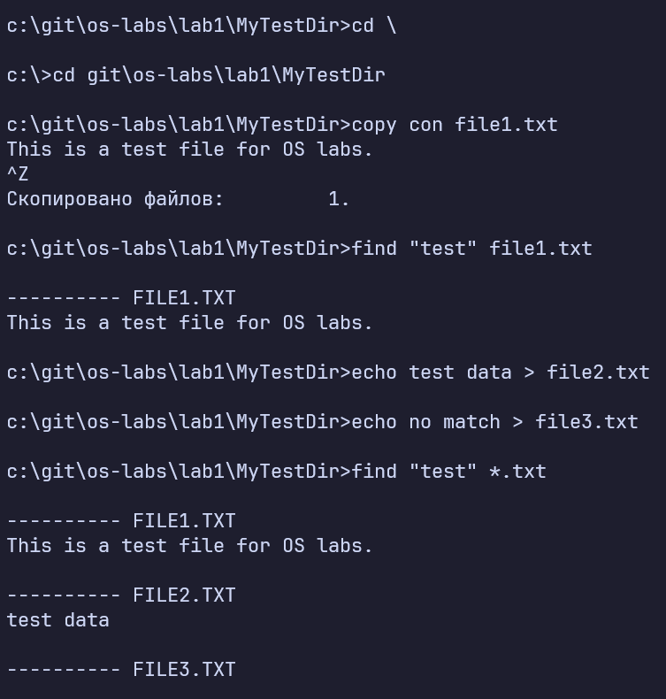
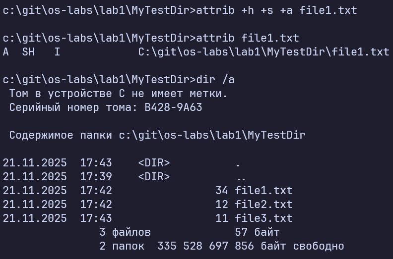

# Лабораторная работа №1
## Операционная система Windows. Командная строка

**Выполнил:** Товмасян Грайр
**Группа:** 3МО-2

### Задание 1. Работа с датой и оформлением
В ходе работы была определена текущая дата, изменена на дату рождения и возвращена обратно.

Изменен вид приглашения командной строки.

### Задание 2. Файловая система
Создан каталог, изучены переходы по папкам.
- `.` обозначает текущий каталог.
- `..` обозначает родительский каталог.

Созданы текстовые файлы, выполнен поиск строки "test" во всех txt файлах.

### Задание 3. Атрибуты
Файлу были присвоены атрибуты: `Hidden`, `System`, `Archive`.

