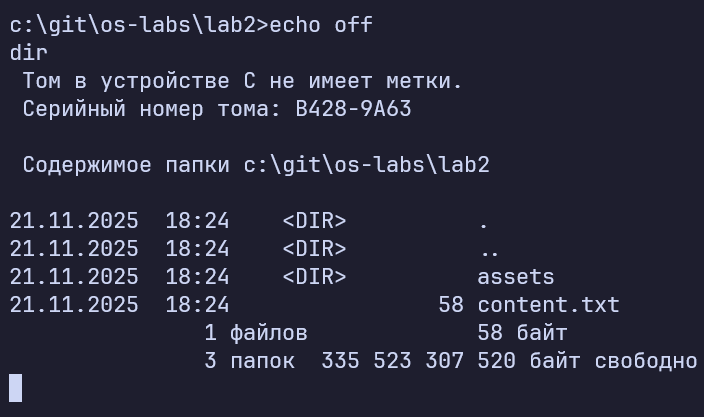
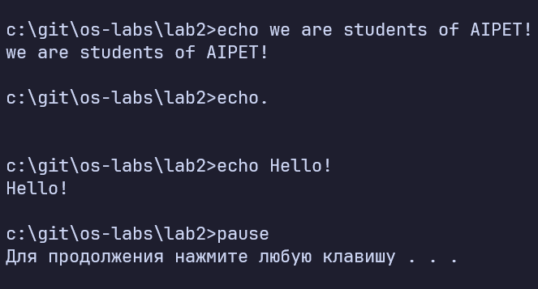
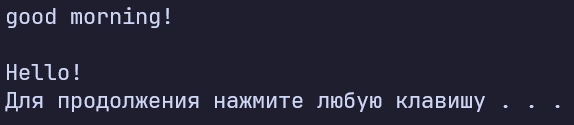
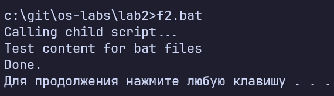
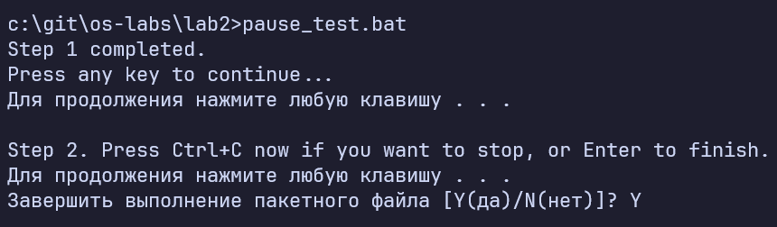
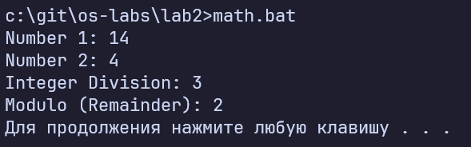
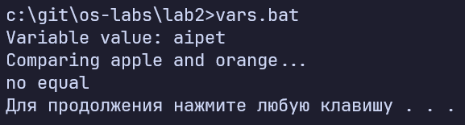
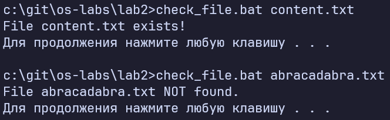
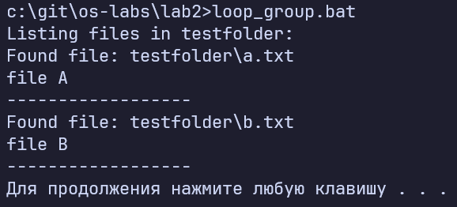

# Лабораторная работа №2
## Операционная система Windows. Основы разработки командных файлов

**Выполнил:** Товмасян Грайр    
**Группа:** 3МО-2

---

### 1. Управление выводом (ECHO)
Изучены режимы отображения команд.
- Команда `echo off` отключает дублирование текста команды в консоли.
- Команда `echo on` возвращает стандартное поведение.

**Скриншот 1. Работа в интерактивном режиме:**  

### 2. Простые пакетные файлы
Созданы файлы `t1.bat` и `t2.bat`.
- В скрипте `t1.bat` использован символ `@` для скрытия конкретной строки.
- В скрипте `t2.bat` использованы комментарии `REM`, которые игнорируются интерпретатором.

**Скриншот 2. Результат выполнения t1.bat:**  

**Скриншот 3. Результат выполнения t2.bat (с комментариями):**  

### 3. Взаимодействие скриптов
Рассмотрена команда `call` для вызова одного bat-файла из другого. Скрипт `f2.bat` успешно вызвал `f1.bat`, который вывел содержимое текстового файла.

**Скриншот 4. Вызов внешнего скрипта (f2 вызывает f1):**  

### 4. Управление потоком выполнения
Изучена команда `pause`. Она приостанавливает выполнение до нажатия любой клавиши. Также протестировано прерывание выполнения с помощью комбинации `Ctrl+C`.

**Скриншот 5. Пауза и прерывание скрипта:**  

### 5. Арифметические операции
С помощью ключа `set /a` выполнены операции целочисленного деления и нахождения остатка от деления.

**Скриншот 6. Работа math.bat (деление и остаток):**  

### 6. Переменные и сравнение строк
Созданы переменные окружения. Реализована проверка совпадения строк через условие `if`.
- Если строки равны — выводится результат.
- Если нет — сообщение "no equal".

**Скриншот 7. Сравнение строковых переменных:**  

### 7. Проверка существования файлов
Скрипт `check_file.bat` использует конструкцию `if exist %1` для проверки наличия файла, переданного в качестве аргумента.

**Скриншот 8. Тест на существующем и несуществующем файле:**  

### 8. Групповые операции (Циклы)
Использован цикл `for` для перебора всех файлов с расширением `.txt` в папке `testfolder` и вывода их содержимого на экран.

**Скриншот 9. Результат работы цикла for:**  

