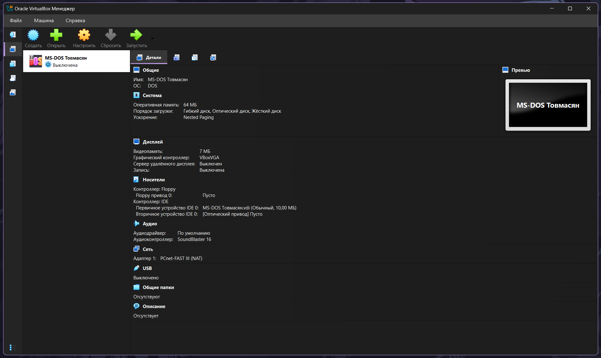
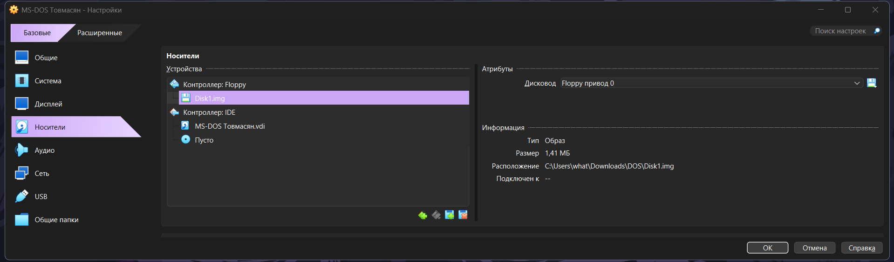
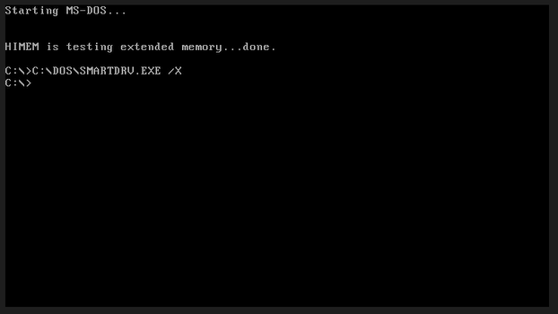
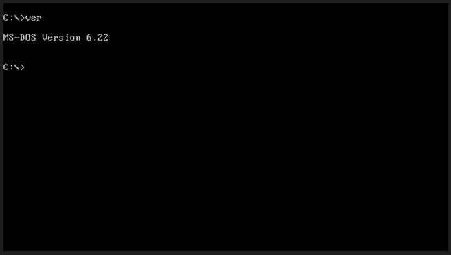
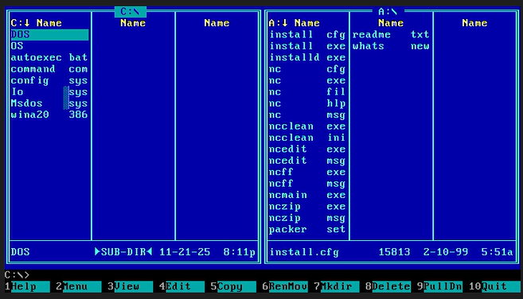

# Лабораторная работа №3
## Виртуальная машина Oracle Virtual Box и MS-DOS

**Выполнил:** Товмасян Грайр    
**Группа:** 3МО-2

---

### 1. Создание виртуальной машины
Была создана ВМ с именем "MS-DOS Товмасян".
Параметры: RAM 64MB, HDD 10MB.  

### 2. Установка операционной системы
Произведена установка MS-DOS 6.22 с трех дискет.    

Успешная загрузка системы:  

### 3. Работа в командной строке
Выполнены команды очистки экрана (`cls`) и просмотра версии (`ver`).    

### 4. Работа с файловой системой
Создан каталог `OS`. Внутри создан файл `2.txt` с перечнем команд.
Файл прочитан командой `type`.  

### 5. Файловый менеджер
Был  запущен Norton Commander.  

