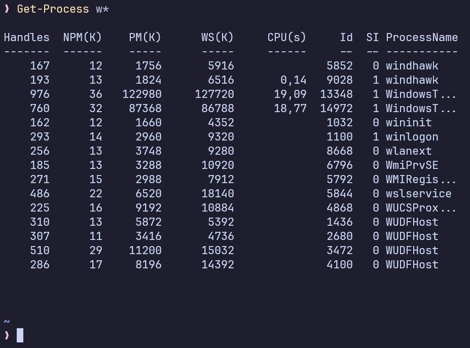
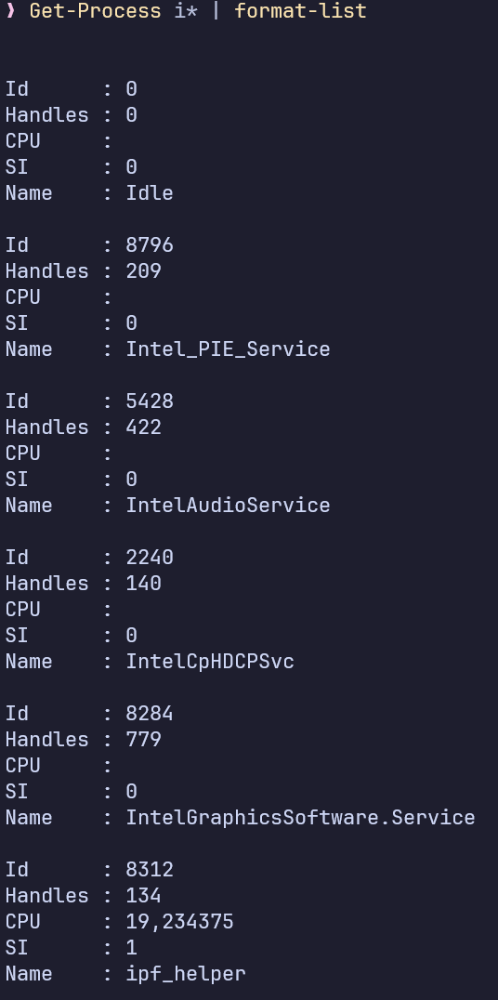
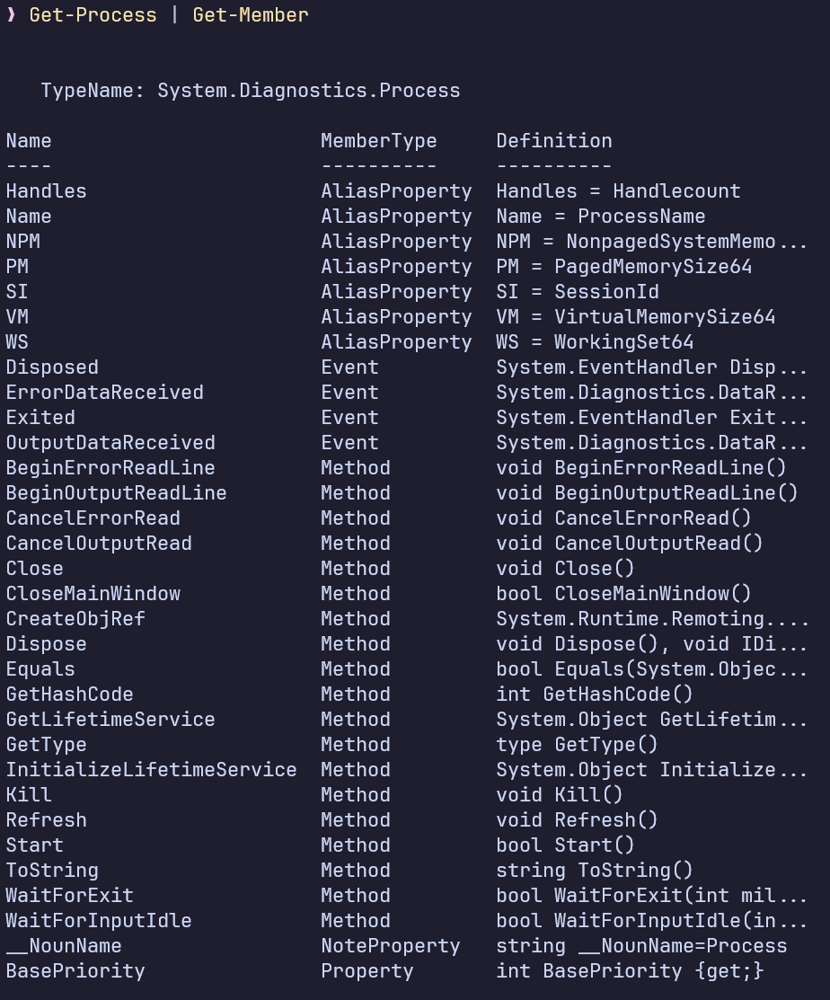
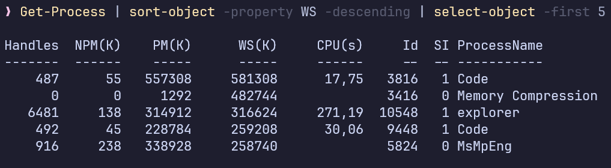
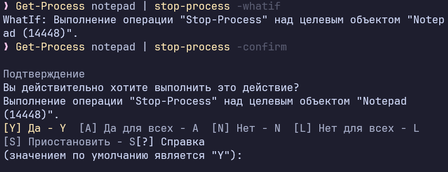
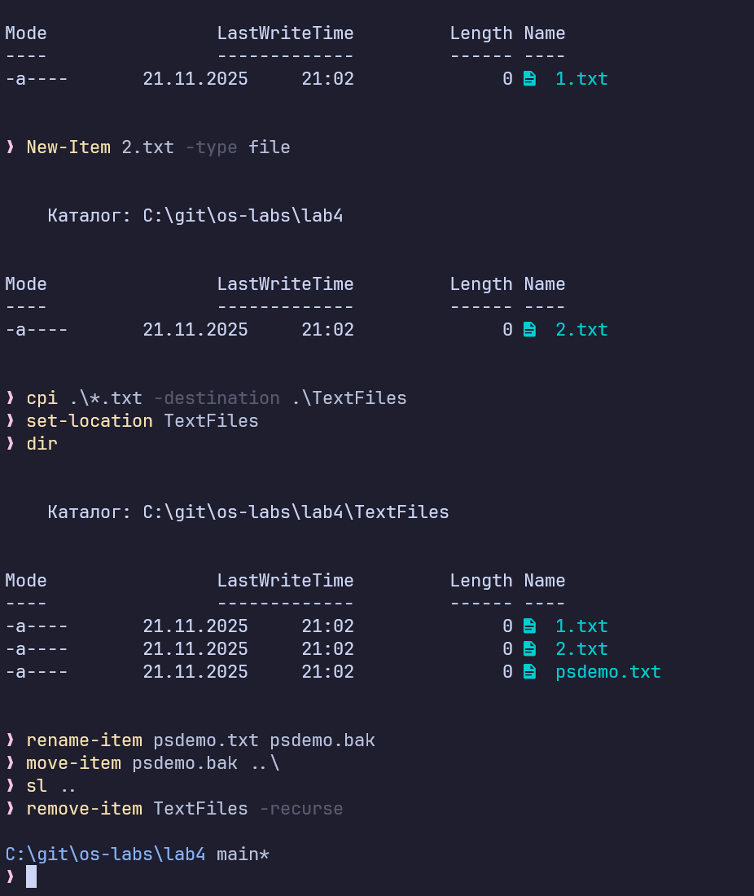

# Лабораторная работа № 4
## Изучение основных возможностей Windows PowerShell

**Выполнил:** Товмасян Грайр  
**Группа:** 3МО-2

---

### 1. Исследование команд и окружения
В ходе работы были изучены основные командлеты (`cmdlet`) PowerShell.
- Получена справка с помощью `Get-Help`.
- Просмотрены списки сервисов (`Get-Service`) и процессов (`Get-Process`).
- Использованы маски (`w*`) для фильтрации вывода.

**Скриншот 1. Список процессов на букву W:**    

### 2. Форматирование и Структура объектов
PowerShell работает с объектами .NET.
- Команда `Format-List` позволяет вывести данные в виде списка свойств.
- Команда `Get-Member` отобразила методы и свойства объекта Process.

**Скриншот 2. Форматирование списка:**  

**Скриншот 3. Структура объекта (Get-Member):** 

### 3. Фильтрация и конвейер (Pipe)
Использован конвейер `|` для передачи объектов.
- Выполнена фильтрация: `where {$_.handlecount -gt 400}`.
- Выполнена сортировка: `sort-object -descending`.
- Выборка первых 5 "тяжелых" процессов.

**Скриншот 4. Топ-5 процессов по потреблению памяти (WorkingSet):** 

### 4. Управление процессами
Протестирована команда `Stop-Process` на приложении Notepad.
Использованы ключи безопасности:
- `-WhatIf`: показывает, что будет сделано, но не выполняет.
- `-Confirm`: запрашивает подтверждение.

**Скриншот 5. Работа с ключом WhatIf:** 

### 5. Файловая система
С помощью PowerShell выполнены стандартные файловые операции:
1.  Создана директория (`ni -ItemType directory`).
2.  Созданы и скопированы файлы (`New-Item`, `Copy-Item`).
3.  Произведено переименование (`Rename-Item`) и перемещение (`Move-Item`).
4.  Папка удалена рекурсивно (`Remove-Item -recurse`).

**Скриншот 6. Демонстрация работы с файловой системой:**    

