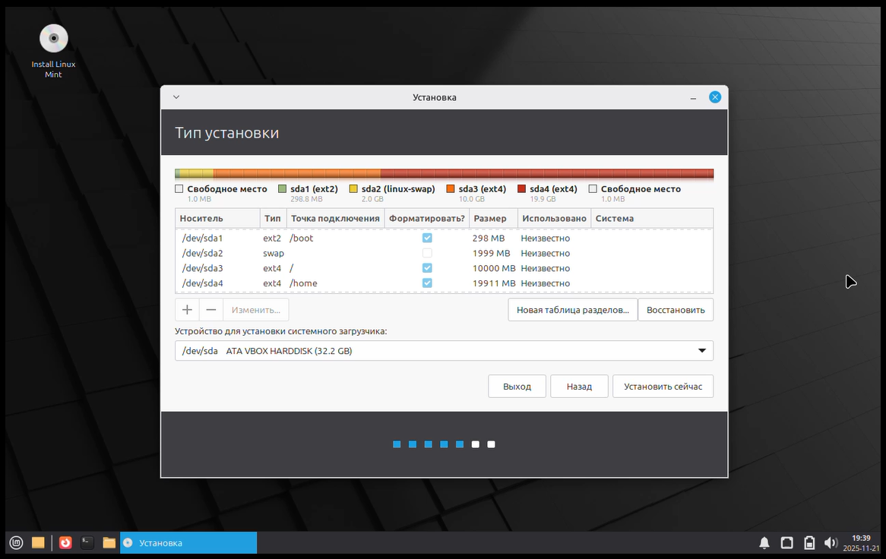
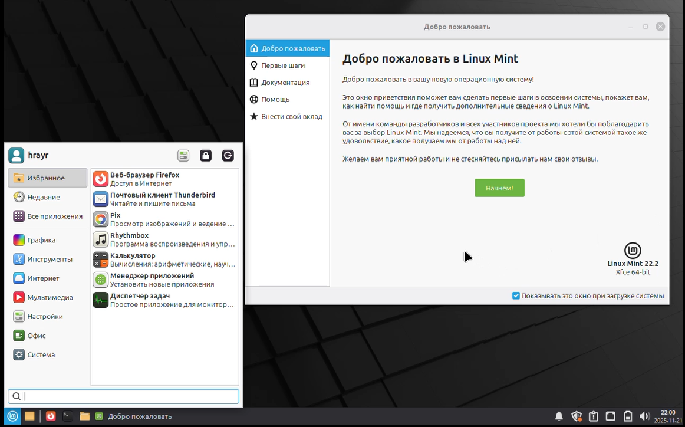

# Лабораторная работа № 5
## Установка дистрибутива Линукс (Linux Mint) на виртуальную машину

**Выполнил:** Товмасян Грайр  
**Группа:** 3МО-2

---

### 1. Подготовка и выбор дистрибутива
В качестве дистрибутива был выбран **Linux Mint (Xfce Edition)**.
Создана виртуальная машина с параметрами:
- RAM: 4096 МБ
- HDD: 30 ГБ

### 2. Разметка диска (Ручной режим)
Установка производилась в режиме "Другой вариант".
Была создана таблица разделов и выполнена ручная разметка виртуального жесткого диска:

1.  `/boot` — 300 МБ (Ext2) — для загрузчика.
2.  `swap` — 2000 МБ — раздел подкачки.
3.  `/` (root) — 10000 МБ (Ext4) — для системы.
4.  `/home` — остальное место (Ext4) — для пользовательских файлов.

**Скриншот 1. Окно установщика с настроенными разделами:**	

### 3. Завершение установки
Был выбран часовой пояс, создана учетная запись пользователя.
После завершения копирования файлов и настройки системы виртуальная машина была перезагружена.
Произведен успешный вход в систему.

**Скриншот 2. Рабочий стол установленной ОС Linux Mint:**	

